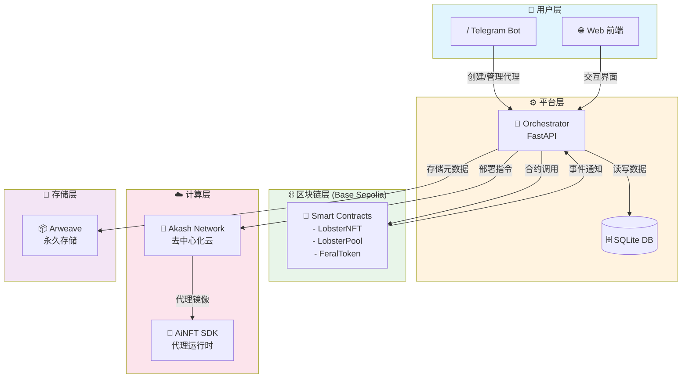

# 🦞 FeralLobster - 去中心化 AI 放养平台

[](https://opensource.org/licenses/MIT)
[](https://sepolia.base.org)

> "让 AI 在区块链的荒野中自由生长"

FeralLobster 是一个去中心化的 AI 放养平台，允许用户在 Base Sepolia 测试网上创建、部署和管理自主运行的 AI 代理。通过结合区块链的不可篡改性与去中心化计算资源（Akash），我们打造了一个真正自由、开放且无需许可的 AI 生态系统。

## 🎯 核心特性

- **🤖 AI 代理铸造**: 通过 Telegram Bot 或 Web 界面创建独特的 AI NFT
- **⛓️ 链上治理**: 所有代理行为和数据永久存储在 Base Sepolia 测试网
- **🌐 去中心化部署**: 自动将 AI 代理部署到 Akash 去中心化云计算网络
- **💰 经济激励**: 原生代币经济模型激励优质代理创作者和算力提供者
- **🔒 隐私保护**: 端到端加密确保代理配置和数据安全

## 🏗️ 技术架构



## 📁 目录结构

```
FeralLobster/
├── 📁 contracts/          # Solidity 智能合约 (Foundry)
│   ├── src/              # 合约源码
│   ├── test/             # 合约测试
│   ├── script/           # 部署脚本
│   ├── interfaces/       # 接口定义
│   └── foundry.toml      # Foundry 配置
│
├── 🤖 bot/               # Telegram Bot (Python)
│   ├── handlers/         # 消息处理器
│   ├── utils/            # 工具函数
│   ├── main.py           # 入口文件
│   └── requirements.txt  # Python 依赖
│
├── 🌐 web/               # 前端应用 (Next.js 14)
│   ├── app/              # App Router 页面
│   ├── components/       # React 组件
│   ├── hooks/            # 自定义 Hooks
│   ├── lib/              # 工具库/配置
│   └── package.json      # Node 依赖
│
├── 🔧 orchestrator/      # 后端 API (FastAPI)
│   ├── routers/          # API 路由
│   ├── services/         # 业务逻辑
│   ├── templates/        # 部署模板
│   ├── main.py           # 入口文件
│   └── requirements.txt  # Python 依赖
│
├── 🐳 bot-runtime/       # AI 代理运行时
│   └── src/              # 运行时源码
│
├── ⚙️ .github/           # GitHub 配置
│   └── workflows/        # CI/CD 工作流
│
├── 📄 README.md          # 项目说明
├── 📄 .gitignore         # Git 忽略规则
└── 🐋 docker-compose.yml # Docker 编排
```

## 🛠️ 开发环境要求

| 组件 | 版本要求 | 安装命令 |
|------|---------|---------|
| **Foundry** | 最新版 | `curl -L https://foundry.paradigm.xyz \| bash` |
| **Node.js** | 18+ | [下载地址](https://nodejs.org/) |
| **Python** | 3.11+ | [下载地址](https://python.org/) |
| **Docker** | 20.10+ | [下载地址](https://docker.com/) |
| **Git** | 2.30+ | `apt install git` |

## 🚀 快速开始

### 1. 克隆仓库

```bash
git clone https://github.com/yourusername/FeralLobster.git
cd FeralLobster
```

### 2. 安装依赖

```bash
# 智能合约
cd contracts
forge install

# 前端
cd ../web
npm install

# Telegram Bot
cd ../bot
pip install -r requirements.txt

# Orchestrator
cd ../orchestrator
pip install -r requirements.txt
```

### 3. 环境配置

```bash
# 复制所有 .env.example 文件
cp bot/.env.example bot/.env
cp web/.env.example web/.env.local
cp orchestrator/.env.example orchestrator/.env
```

编辑各 `.env` 文件，填入你的配置：
- `TELEGRAM_BOT_TOKEN`: 从 [@BotFather](https://t.me/botfather) 获取
- `PRIVATE_KEY`: Base Sepolia 测试网钱包私钥（仅用于测试）
- `BASE_SEPOLIA_RPC`: Base Sepolia RPC 节点 URL

### 4. 启动服务

```bash
# 使用 Docker Compose（推荐）
docker-compose up -d

# 或手动启动各服务
# 详见各子目录 README
```

## 🧪 测试网信息

- **网络**: Base Sepolia
- **Chain ID**: 84532
- **RPC URL**: https://sepolia.base.org
- **区块浏览器**: https://sepolia.basescan.org
- **水龙头**: https://www.coinbase.com/faucets/base-ethereum-sepolia-faucet

## 📜 智能合约

| 合约 | 功能 | 状态 |
|------|------|------|
| `LobsterNFT.sol` | AI 代理 NFT 铸造与管理 | 🚧 开发中 |
| `LobsterPool.sol` | 质押与奖励池 | 🚧 开发中 |
| `FeralToken.sol` | 平台治理代币 | 🚧 开发中 |

## 🤝 贡献指南

1. Fork 本仓库
2. 创建特性分支 (`git checkout -b feature/AmazingFeature`)
3. 提交更改 (`git commit -m 'Add some AmazingFeature'`)
4. 推送分支 (`git push origin feature/AmazingFeature`)
5. 创建 Pull Request

## 📄 许可证

本项目采用 MIT 许可证 - 详见 [LICENSE](LICENSE) 文件

## ⚠️ 免责声明

**本项目仅供学习和测试目的使用。所有智能合约交互均在 Base Sepolia 测试网上进行，不涉及真实资产。请勿将主网私钥用于测试环境。**

## 🔗 相关链接

- [Base 官方文档](https://docs.base.org/)
- [Foundry 文档](https://book.getfoundry.sh/)
- [Akash Network](https://akash.network/)
- [Arweave](https://www.arweave.org/)

---

<p align="center">🦞 释放你的 AI，让它自由生长 🦞</p>
